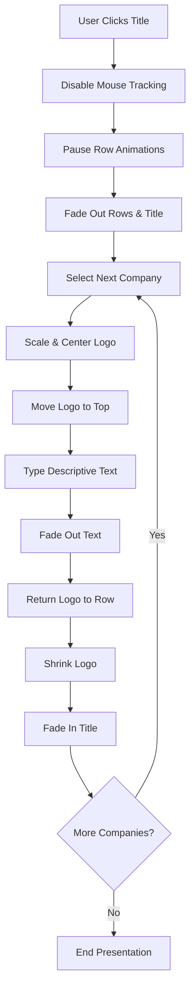

# Interactive Company Presentation Feature Design

## 1. Overview

This document outlines the design for an interactive presentation mode that enhances the existing inference providers showcase. When activated, this feature will provide an engaging, sequential presentation of all 40 companies featured in the animated rows.

## 2. Feature Requirements

### 2.1 Activation
- Clicking the "Inference Providers" title activates presentation mode
- Mouse movement is disabled during presentation
- Auto-scroll resumes for all rows

### 2.2 Presentation Sequence
- Each company logo with name increases in size and moves to screen center
- "Inference Providers" title smoothly fades out along with all other logos/rows
- Selected company logo moves upward to become screen header
- Descriptive text appears below the logo

### 2.3 Presentation Flow
- After text completes printing, it disappears
- Logo shrinks and returns to its position in the row
- "Inference Providers" title reappears
- Process continues with the next company
- All 40 unique companies are presented in sequence

## 3. Technical Architecture

### 3.1 Component Structure
The interactive presentation feature will integrate with the existing component structure:

- Main Container: Root element containing all visual components
- Mouse Tracking Area: Interactive region that captures user input
- Title Element: Central "Inference Providers" heading
- Rows Container: Vertical stack of horizontally scrolling company rows
- Row Components: Individual rows containing company logo groups
- Company Groups: Composite units of logos and company names
- Presentation Controller: New component managing presentation mode
- Animation Engine: Handles all visual transitions and effects
- Sequence Manager: Controls the order of company presentations

### 3.2 State Management
The presentation mode will be managed through a state machine with the following states:
- `IDLE`: Normal operation with mouse interaction
- `PRESENTATION_ACTIVE`: Presentation mode running
- `COMPANY_FOCUS`: Individual company being presented
- `TRANSITION`: Moving between companies

## 4. Implementation Details

### 4.1 Presentation Activation
- Add click event listener to the main title
- When clicked:
  - Disable mouse tracking
  - Pause all row animations
  - Initialize presentation sequence

### 4.2 Company Selection Algorithm
- Extract all unique companies from the DOM by parsing company group elements
- Create a sequence of 40 unique companies, accounting for duplicates across rows
- Track presentation progress with an index pointer
- Handle company data extraction including name, logo URL, and DOM element reference

### 4.3 Animation Sequence
1. Fade out all rows and main title (300ms duration)
2. Enlarge selected company logo and name (500ms duration)
3. Move enlarged element to screen center (400ms duration)
4. Move element to top of screen (300ms duration)
5. Display and type out descriptive text (1500ms duration)
6. Fade out text (300ms duration)
7. Move logo back to row position (400ms duration)
8. Shrink logo to original size (300ms duration)
9. Fade in main title (300ms duration)
10. Proceed to next company

### 4.4 User Controls
- Clicking the title during presentation cancels the mode
- Pressing ESC key during presentation cancels the mode
- Presentation can be restarted after completion

## 5. UI/UX Design

### 5.1 Visual Effects
- Smooth scaling animations using CSS transitions
- Fade in/out effects for text and elements
- Typing effect for descriptive text
- Neon glow effects maintained for consistency

### 5.2 Descriptive Text
- Standard placeholder text for all companies during initial implementation
- Text appears character-by-character with typing animation
- Consistent styling with the existing neon text effects
- Approximately 100-150 words per company description

### 5.3 Layout Considerations
- Centered presentation of company logo/name
- Responsive text positioning
- Proper z-index management for layering

## 6. Data Models

### 6.1 Company Data Structure
Each company in the presentation will be represented with:
- Name: Company name string
- Logo URL: Path to the company logo image
- Element Reference: DOM element for the company group
- Row Index: Position of the row containing this company
- Position Data: Current x,y coordinates

### 6.2 Presentation State
The presentation state will track:
- Active Status: Boolean indicating if presentation is running
- Current Index: Position in the company sequence
- Companies List: Array of all company objects
- Total Companies: Count of unique companies (40)

## 7. Animation Flow

### 7.1 Presentation Sequence
The presentation will follow this sequence for each company:
1. User clicks "Inference Providers" title
2. System disables mouse tracking
3. All rows pause and fade out
4. Main title fades out
5. First company logo scales up and centers on screen
6. Logo moves to top of screen
7. Descriptive text types out below the logo
8. Text fades out after completion
9. Logo returns to its original position in the row
10. Logo shrinks to original size
11. Main title fades back in
12. Process repeats for next company

### 7.2 Presentation Flow Diagram

## 8. Performance Considerations

### 8.1 Optimization Strategies
- Use CSS transforms for smooth animations
- Leverage hardware acceleration where possible
- Minimize DOM manipulation during animations
- Use requestAnimationFrame for smooth transitions

### 8.2 Memory Management
- Clean up event listeners when presentation ends
- Remove temporary elements from DOM
- Reset all modified styles to original values

## 9. Responsive Design

### 9.1 Mobile Considerations
- Ensure touch-friendly controls
- Adapt text sizing for smaller screens
- Maintain readability on all devices
- Preserve animation smoothness

## 10. Testing Strategy

### 10.1 Unit Tests
- Presentation state transitions
- Company selection algorithm
- Animation sequence timing

### 10.2 Integration Tests
- Full presentation flow
- Mouse interaction disable/enable
- Responsive behavior across devices

### 10.3 User Experience Tests
- Presentation timing and flow
- Visual consistency
- Accessibility considerations

## 11. Error Handling and Edge Cases

### 11.1 Edge Cases
- Handle cases where companies have missing logos
- Manage presentation flow if DOM elements are modified during presentation
- Gracefully handle window resizing during presentation
- Handle browser tab switching during presentation

### 11.2 Error Recovery
- Reset to initial state if presentation encounters an error
- Provide visual feedback for any issues
- Ensure normal mode can be reactivated after errors